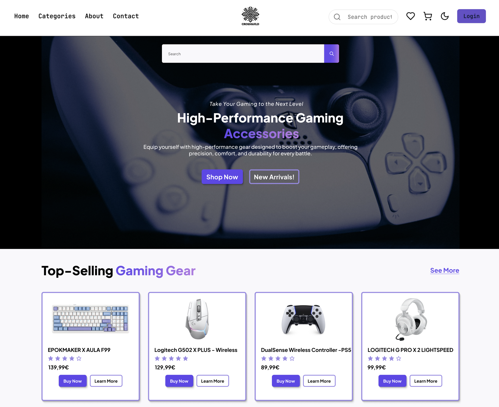
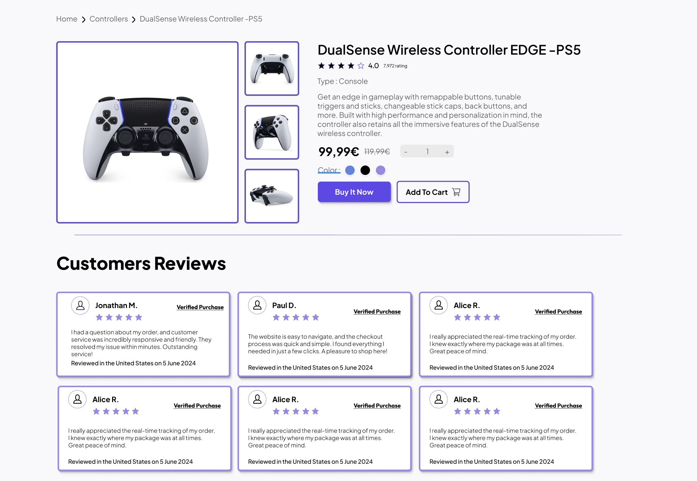
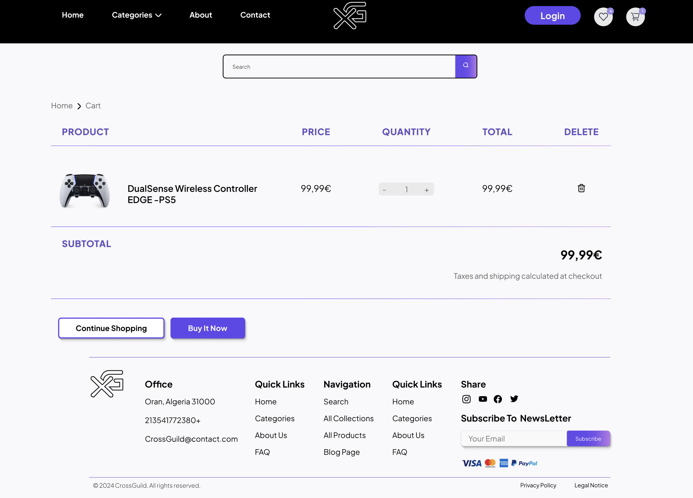

# From a Fun Design Experiment to an End-to-End Product

*How a project changed my ambition and taught me to think like a product engineer.*

CrossGuild was never meant to become one of my most important projects. It began as a simple idea in my head: a futuristic, minimalist e-commerce platform for gaming accessories.

I started building it as a frontend project without a roadmap, a business plan, or a complex architecture. I only wanted to turn an idea into something real.

But the more I built, the more the project changed direction. It became a potential business idea, then my graduation project, and eventually the most complete product engineering experience I had ever created for myself.

At what point does an application stop being a collection of pages and start becoming a product?

## It Started with a Design

At first, I only thought about what people would see. I wanted a clean interface with a futuristic identity, so I focused on layouts, components, and the overall shopping experience.

I had not yet considered users, data, permissions, or maintainability. Those problems did not exist until I tried to make the design work like a real application.

## When CrossGuild Became a Business Idea

Late one night, a close friend and I talked about starting an online business selling gaming accessories. For the first time, I imagined someone actually using CrossGuild.

That changed the questions I was asking:

- How would customers make a purchase?
- How would the storefront connect with the administration system?
- What would it take to turn CrossGuild into a real, usable product?

The project was no longer only a frontend exercise.

## Turning It into My Graduation Project

Later, I needed to choose a topic for my graduation project. I first considered building an AI system, but I did not yet have the skills required to create the kind of project I had in mind.

Then I remembered the side project that was already growing in the background.

Making CrossGuild my graduation project gave it a deadline and pushed me to become more ambitious. The deadline gave the project urgency, but it did not give it an ending.

## Learning the Stack by Needing It

At that point, the tools I knew best were React, TypeScript, and Tailwind CSS. I understood what the rest of a full-stack application was supposed to look like, but I had never built one from end to end.

CrossGuild made me realize that I did not need to master a technology before using it. I could learn it when the product gave me a reason to.

**Read → Apply → Fail → Find the issue → Fix it → Repeat**

That cycle became my most effective way of learning.

I did not learn Prisma because I wanted another technology on my résumé. I learned it because products, carts, orders, reviews, and users needed relationships that had to remain consistent.

## Two Sides of the Same Product

The customer-facing side grew to include product discovery, categories, reviews, wishlists, carts, and orders. The administration side required product management, order tracking, content management, and reporting.

Building the storefront taught me how customers discover and buy. Building the administration system taught me how a business operates the product after launch.

CrossGuild did not have one type of user anymore. Every decision had to work for both sides.

## The Bugs That Made It Real

As the features became connected, the bugs also became more complex. One of the most memorable caused products to be duplicated when an order was created.

What looked like a small checkout bug crossed several layers: the cart state, the order creation logic, and the database relationships. Fixing it forced me to follow the complete flow of data, from a user action to the API, through the business logic, and into the database.

The most frustrating bugs were also the moments when CrossGuild taught me the most.

## When the Codebase Became the Problem

Over time, pages became heavier, requests were harder to trace, and similar components appeared in different parts of the application. Adding a feature often meant touching unrelated files and risking unexpected regressions.

The codebase itself had become a product problem.

I reorganized it around three main layers:

- `app/` for lightweight routes
- `features/` for business domains
- `shared/` for reusable components and infrastructure

The first version taught me how to make features work. The refactor taught me how to make a product change safely.

## Rebuilding Without Starting Over

I did not want to hide the problems behind a full rewrite. I migrated the existing codebase incrementally, keeping the application functional while changing the system underneath it.

API routes became lighter. Input validation, server-side business logic, and data access gained clearer boundaries. Error handling became more consistent, and the code became easier to read, test, and extend without changing its existing behavior.

Greenfield development taught me how to create. Refactoring taught me how to preserve.

## From “It Works” to “I Can Trust It”

My first goal was to build a working MVP. But as the application grew, manually checking every feature was no longer enough. A change in one part of the product could silently break another.

I introduced Vitest and Playwright to test important flows such as authentication, administrator access, cart management, and checkout.

Testing taught me that a feature is not complete because it worked once. It also needs to remain reliable when the product changes.

## What I Was Really Building

CrossGuild never became the business idea my friend and I imagined that night, but it became something more valuable to me.

What started as a design experiment became my graduation project, my introduction to full-stack development, and the project that taught me the most about product engineering.

There was no single moment when CrossGuild became a product. It happened gradually: when I started thinking about real users, when the storefront needed an administration system, when data had to remain consistent, and when changing the code safely became as important as adding new features.

I thought I was building an e-commerce platform. In reality, I was also building the way I approach products today.
